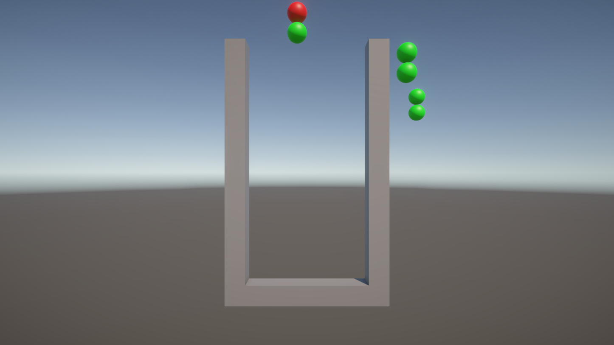
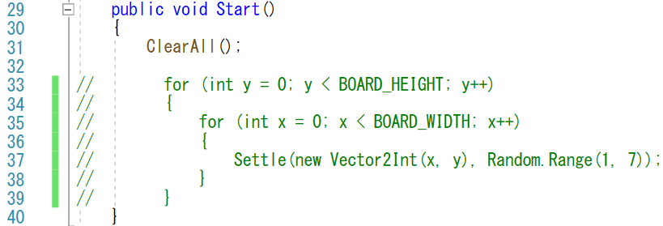
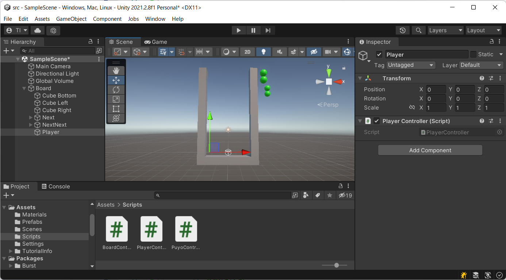
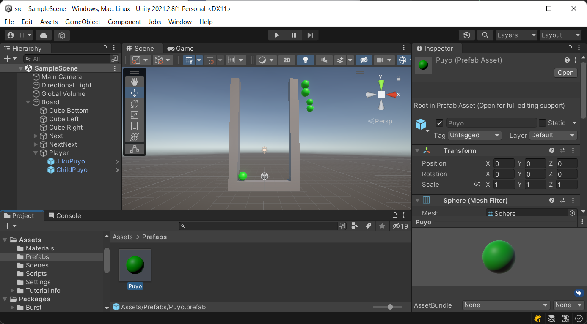
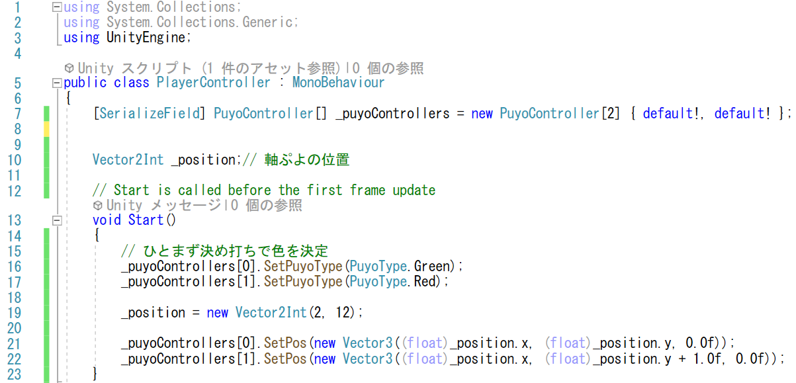
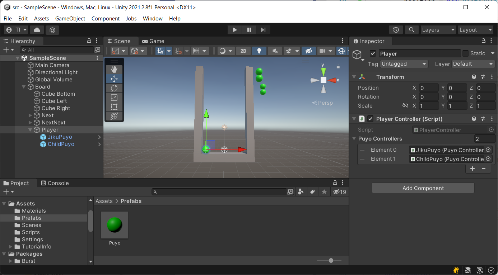
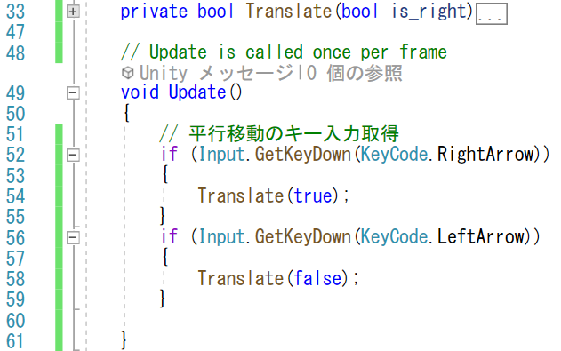
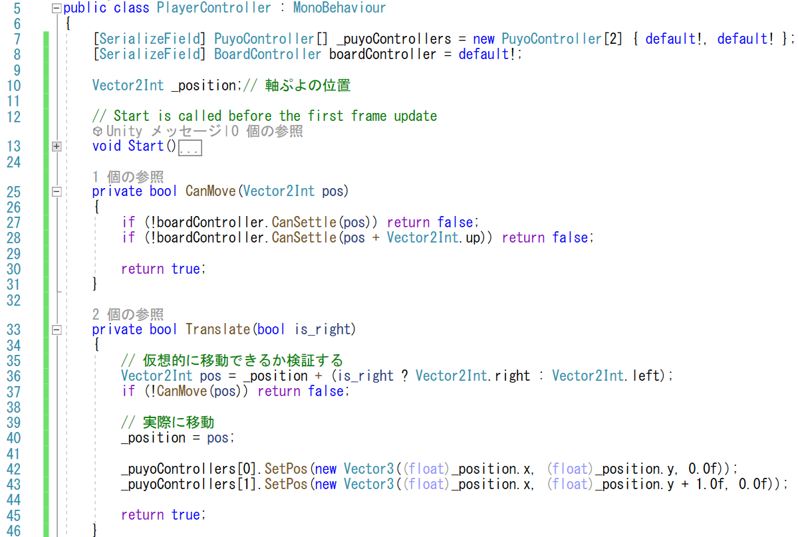
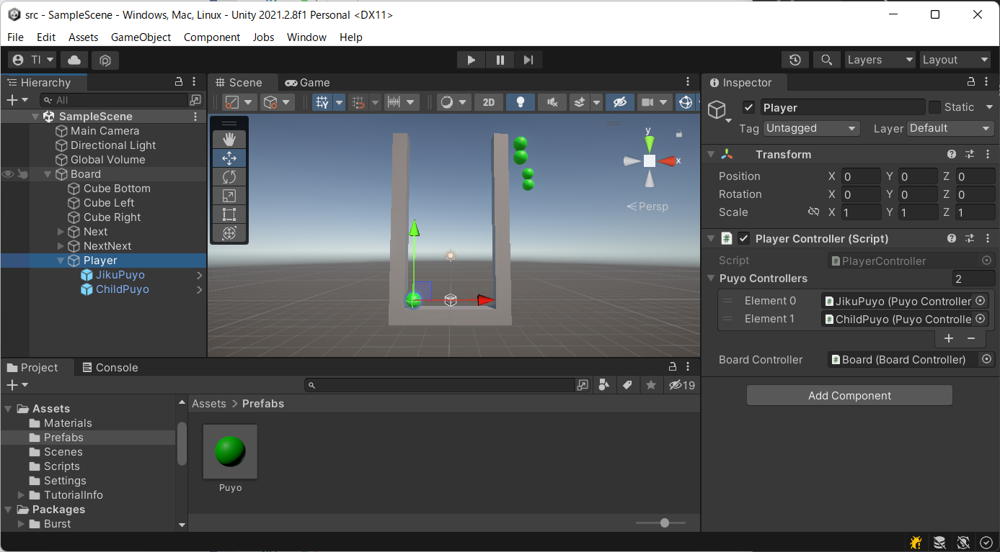

# 概要
いよいよ主人公の登場です。
キー入力を受けて、動くキャラクターを導入します。
このゲームの主人公は、落ちてくる2つのぷよです。まずは、このぷよ達を表示して、左右に動かせるようにしましょう。

# 手順

## 前回のテスト処理を消去
まずは、前回、検証として盤面に敷き詰めた色とりどりのぷよを取り除きましょう。
- 「BoardController」を編集
  - 「Start」メソッド中で設定したぷよの設置を削除 (33-39行目)

## プレイヤーを追加
オブジェクトとしての存在を作るために、ゲームオブジェクトとスクリプトを追加します。
- 「Create Empty」で、「Player」ゲームオブジェクトを追加
  - 「Board」の子オブジェクトとして追加
  - 位置「Position」は(0,0,0)に設定
- 「Scripts」フォルダにC#スクリプトを「PlayerController」の名前で追加
- 「PlayerController」を「Player」ゲームオブジェクトにD&Dで追加

## 表示するぷよを追加
- 「Player」ゲームオブジェクトの子供に「Puyo」プレハブをD&Dで2つ追加
  - 一つは「JikuPuyo」、もう一つは「ChildPuyo」と名前をつけておきます
    - 名前は区別できれば良いですが、ぷよぷよでは回転する際の中心となるぷよを「軸ぷよ」、周りで回るぷよを「子ぷよ」と呼ぶようなので、それにならいました

## ぷよの初期配置
### スプリプトの編集
- ぷよのスクリプトを配列の形で持つ (7行目)
  - インスペクターで設定できるように「[SerializeField]」を付ける
  - 設定漏れに気付けるように「default!」を初期値として設定
- ぷよぷよの色を設定 (16, 17行目)
  - ひとまず適当に(緑と赤に)設定
- ぷよの位置を設定
  - (軸ぷよの)位置を保持するメンバー「_position」を導入 (10行目)
  - (軸ぷよの)位置を(2,12)に設定 (19行目)
    - ぷよぷよが登場する標準的な場所
  - 表示するゲームオブジェクトの位置を設定 (21, 22行目)

### プレイヤーのゲームオブジェクトに子供のゲームオブジェクトを設定
スクリプトで設定できるようにした「PuyoController」に、実際に各ゲームオブジェクトのスクリプトを設定します。
- インスペクターの「PlayerContoller」の「Puyo Contollers」に「JikuPuyo」と「ChildPuyo」のゲームオブジェクトをD&Dで設定

## キー入力
ぷよを動かしてみましょう。キーボードを押した瞬間は「Input.GetKeyDown」で判別できます。
- 「Update」中で、「Input.GetKeyDown」で「→」と「←」が押されたのを毎フレーム調べる (52, 56行目)
  - 「→」や「←」は、「KeyCode.RightArrow」、「KeyCode.LeftArrow」のキーコードで調べられる
  - キーが押された際に処理するメソッド「Translate」を用意する (33行目)

### ぷよを左右に動かす
「Translate」メソッドを実装します。
- 動いた先の場所を計算 (36行目)
  - 右移動ならx成分を+1, そうでなければ（左移動なら）x成分を-1します
- 移動できるか検証します (37行目)
  - 「BoardController」スクリプトに、移動した先の軸ぷよと子ぷよの状態が、空きになっているか問い合わせます (27,28行目)
    - 「BoardController」はあらかじめ設定しておくように「[SerializeField]」をつけてメンバー変数として用意しておきます (8行目)
  - 移動できないなら、処理を終了
- 移動できるなら、実際に動かす
  - 「_position」プロパティを更新 (40行目)
  - ぷよのゲームオブジェクトの位置を更新 (42,43行目) 

## 「BoardController」を設定
- インスペクターの「PlayerContoller」の「Board Contollers」に「Board」のゲームオブジェクトをD&Dで設定

# 検証

実行すると、枠の上の方にぷよぷよが縦に並んで表示され、カーソルキーの←→で左右に動くはずです。
- 枠を超えてぷよぷよが動かなければ成功です。
  - 見た目的には、枠の上の空間を横切れるように見えますが、見えない壁に阻まれます